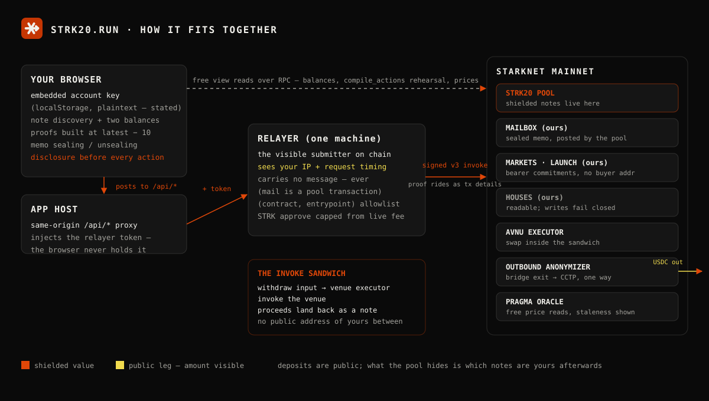

# strk20.run — architecture

The [README](../README.md) says what exists and what we refuse to claim. This page says how the
thing is built, for a reader who wants to check the claims against the code.



## The account is an embedded key

The key is derived in the browser on first load — no wallet, no email, no seed phrase before
anything works. That is also what makes the hosted demo work without login: a consequence, not a
waiver. The key sits in `localStorage` in plaintext, which is an accepted and argued risk written
down at `packages/protocol/src/session-key.ts` rather than a detail nobody mentioned. "Lock"
therefore means a screen lock, and the app says so in those words instead of implying encryption
it does not perform.

Two balances exist and are never summed: **shielded** (pool notes) and **public** (ERC-20).
An unknown balance renders as `—`, never `0`.

## The relayer

One Node process (`packages/relayer/src/server.ts`) that exists so that **its** address, rather
than yours, is the visible submitter on the public record. That is a real service and a real trust
assumption: it sees your IP and the timing of your request. It holds no viewing key and cannot
read sealed messages.

The browser never talks to it directly. It posts to same-origin `/api/*` paths and the app host
injects the relayer's auth token — the token never ships to the browser. That is also why the
streaming endpoint is a POST: an `EventSource` can set neither a `content-type` nor an auth header.

What bounds a process that holds a funded key:

- It refuses anything outside a small allowlist of `(contract, entrypoint)` pairs
  (`allowlist-calls.ts`).
- The STRK approve on every sponsored call is capped from the **live** pool fee
  (`get_fee_amount`), read at call time — no protocol number is hardcoded anywhere in this
  repository, because the pool's fee is mutable with no upgrade delay.
- It binds `127.0.0.1` by default; widening that is a deliberate act (`RELAYER_HOST`).

Beyond submission it runs the product's background jobs, each answering its own degrade state
rather than taking the process down: chat rooms (in-memory backlog — 50 messages per room,
dropped 30 minutes after a room goes quiet), the public name directory, the onboarding
sponsorship ledger, the faucet, the chain feed the app streams from, the markets groundskeeper,
and the governance teller.

### Running it, and the one setting you must not skip

```bash
cp .env.example .env      # fill in the two relayer values; see that file
npx tsx packages/relayer/src/server.ts
```

**If this server is reachable through a proxy, `RELAYER_AUTH_TOKEN` is mandatory.** The browser
posts to the same-origin relative path `/api/submit`, and the server accepts that path so a proxy
can forward it. The moment that rewrite exists, loopback has stopped being a boundary — and
nothing warns you, because the off-host warning keys off `RELAYER_HOST`, which you never changed.
Behind a proxy every internet client arrives with no `Origin` header, which is exactly the shape
the other checks treat as a trusted same-process caller.

Requiring `content-type: application/json` is a CSRF control. It is not authentication.

| Variable | Default | What it does |
|---|---|---|
| `RELAYER_AUTH_TOKEN` | unset | Shared secret required as `x-relayer-auth`. **Required behind a proxy.** |
| `RELAYER_ALLOWED_ORIGINS` | unset | Comma-separated browser origins. Can only refuse — see below. |
| `RELAYER_HOST` | `127.0.0.1` | Interface to bind. Empty is treated as unset. |
| `PORT` | `8787` | Port to listen on. |

`RELAYER_ALLOWED_ORIGINS` **cannot grant access, only withhold it.** A browser request carrying
both an `Origin` and `application/json` is by definition cross-origin, so it is preflighted, and
this server answers no CORS headers — the request never arrives. Setting an origin does not let a
web app in. It is not a substitute for `RELAYER_AUTH_TOKEN`.

In development, `apps/web/vite.config.ts` forwards `/api/*` to `127.0.0.1:8787` and strips the
`Origin` header, so the app's same-origin paths reach a relayer started the ordinary way. Point it
somewhere else with `RELAYER_ORIGIN`.

**Rooms live in memory, so the deployment must run exactly one machine.** Two would each hold half
of every conversation and neither would know. `fly.toml` pins that with `auto_stop_machines =
false` and `min_machines_running = 1`; it also mounts a volume at `/data` for the ledgers and the
name directory, which unlike the chat backlog must survive a deploy.

## The invoke sandwich

Swap and bridge are the same shape: withdraw the input to the venue's privacy executor, invoke
the executor, and the proceeds land back in the pool as a note. Value never touches a public
address of yours in between. The venues are AVNU's privacy executor (swap) and StarkWare's
deployed `OutboundAnonymizer` (bridge out via CCTP — an exit only; there is no inbound leg).

## Rehearsal and proving discipline

Rules that were each learned against real mainnet fees, now load-bearing:

- **Every action list is rehearsed against a free view before a funded transaction.** The pool's
  `compile_actions` is a view, so a malformed list is caught for nothing — and it must be, because
  a malformed list burns the fee even when it reverts. What that view does *not* catch is recorded
  in `evidence/day0-markets-launch-checks.json`: an unmatched open note reverts **after** the fee,
  so the client asserts the open-note count equals the expected deposits.
- **The proof and its public facts ride as v3 transaction details, both or neither.** Receipts
  never echo them; the sequencer enforces the pairing.
- **Value-moving proven transactions carry explicit resource bounds**, because fee estimation
  cannot see the proof and reverts without them.
- **Proofs are built at `latest − 10`**, and nothing proves against state younger than ten blocks
  after a deploy or top-up.
- **One pipeline at a time per account.** A `confirmation-unknown` outcome means the transaction
  may have landed; the pipeline treats it that way instead of retrying blind.
- **Bearer position secrets are stored before the transaction is submitted**, never after —
  `poseidon(secret)` is the commitment and the preimage is the money.

## The build gate reads the artifact

`vite build` exiting 0 is not evidence the app works — with the privacy SDK's `/testing` alias
missing it exits 0, writes a bundle, and the page dies at load with `ReferenceError: Buffer is not
defined`. So the build (ordinary options in `apps/web/vite.config.ts`, no wrapper script) scans
the emitted chunks for Node-only module names, holds the generated route tree against the route
files on disk, reads the emitted stylesheet to prove the design system shipped, caps first-paint
bytes, and refuses any bundler warning that is not on an explicit allowlist.

## Evidence, not assertions

`evidence/` is the audit trail, and only a probe that actually measured something may write into
it. `packages/protocol/src/app-contracts.ts` reads `evidence/markets-launch-deployment.json`;
absent or malformed evidence fails closed. No surface substitutes fixture rows or invented price
movement when a chain read is empty or unavailable. Spent bearer secrets stay in `evidence/` on
purpose — once claimed, the preimage buys nothing, and leaving it in lets any reader hash it and
watch the commitment fall out. Anything still claimable lives in gitignored `.secrets/` instead.

## Our contracts

All on `SN_MAIN`, deployed from `contracts/` (Cairo; `scarb build && snforge test`). Addresses
are read back off the chain into `evidence/markets-launch-deployment.json` rather than copied
from deploy logs — "the transaction succeeded" is a weaker claim than "the class is there now".

| Contract | What it stores |
|---|---|
| `MessageBook` | Sealed chat messages, and value attached to them |
| `Markets` | Market records and bets as bearer commitments — no buyer address |
| `Launch` | Sale records, buys, graduation and refund state — no buyer address |
| `Governance` (Houses) | Houses, proposals, sealed ballots, tallies |

## Houses — the sealed-ballot design in one paragraph

A ballot is a Pedersen vector commitment on the Stark curve: the voter's **weight is public**
(that is what makes eligibility checkable), the **choice is sealed**, and no address appears on
the ballot itself. The **Teller** (`packages/relayer/src/teller.ts`) is a *named* trust party —
it can see choices before close and could refuse service, and the app says so instead of
pretending otherwise; what it cannot do is forge an outcome, because the tally must satisfy a
commitment equation the contract itself verifies — the chain rejects a wrong tally. Two modes:
secret-until-close (per-ballot reveal after close) and permanently-private (only the aggregate
ever surfaces). The currently deployed class predates the tally-key and duplicate-exclusion
corrections, so the app fails closed on affected writes until a corrected deployment updates the
evidence.

## Keys and processes

Two keys can sign on behalf of this product, and they are deliberately different shapes:

- **deployer** — non-resident. Loaded by a one-shot run, spends once, exits; no server can be
  reached to make it sign. Never the relayer's key: several probes need two distinct callers of
  the same helper to prove anything.
- **relayer** — resident, bounded by the allowlist and the live-fee approve cap above.

The rule that applies to both: **a Starknet account contract must be deployed on-chain before its
key can sign anything.** A funded but undeployed key passes every free pre-check — the balance
reads fine, `compile_actions` accepts it as a sender — and then fails the first thing that costs
money. Verify with a free `getClassHashAt(address)` read before any spend.
